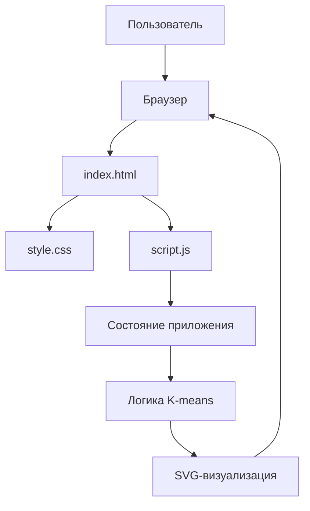

# Интерактивная визуализация алгоритма K-средних

Учебное web-приложение для пошаговой визуализации алгоритма K-средних (K-means).

Проект показывает не только итоговое разбиение точек на кластеры, но и саму механику алгоритма: выбор ближайшего центроида, назначение точки к кластеру, пересчёт центроидов и повторение итераций до устойчивого результата.

## Рабочая ссылка

Приложение опубликовано через GitHub Pages:

https://Hello0407.github.io/k-means_visualization/

## Репозиторий

GitHub-репозиторий проекта:

https://github.com/Hello0407/k-means_visualization

## Цель проекта

Цель проекта — сделать наглядное приложение, с помощью которого можно понять, как работает алгоритм K-средних на двумерных данных.

Обычное объяснение K-means через формулы не всегда показывает, что именно происходит на каждом шаге. Поэтому в приложении алгоритм разбит на отдельные этапы: сначала пользователь задаёт точки и центроиды, затем приложение показывает, как точки по очереди сравниваются с центроидами и получают цвет ближайшего кластера.

## Кратко об алгоритме K-means

K-means решает задачу кластеризации: нужно разбить набор точек на `k` групп так, чтобы точки внутри одного кластера были ближе к своему центру, чем к центрам других кластеров.

Алгоритм работает итерационно:

1. Задаётся количество кластеров `k`.
2. Выбираются начальные центроиды.
3. Для каждой точки считается расстояние до всех центроидов.
4. Точка относится к ближайшему центроиду.
5. Для каждого кластера пересчитывается новый центроид.
6. Центроиды сдвигаются в новые позиции.
7. Шаги повторяются, пока центроиды почти не перестают двигаться.

## Математическая идея

Расстояние между точкой и центроидом считается по евклидовой формуле:

$$
d(x_i, c_j) = \sqrt{(x_{i1} - c_{j1})^2 + (x_{i2} - c_{j2})^2}
$$

где:

* $x_i$ — точка данных;
* $c_j$ — центроид кластера;
* $d(x_i, c_j)$ — расстояние между точкой и центроидом;
* $x_{i1}, x_{i2}$ — координаты точки;
* $c_{j1}, c_{j2}$ — координаты центроида.

После назначения точек кластерам новый центроид считается как среднее координат всех точек своего кластера:

$$
c_j = \frac{1}{|C_j|} \sum_{x_i \in C_j} x_i
$$

Для двумерного случая это означает отдельный пересчёт координат:

$$
c_{jx} = \frac{1}{|C_j|} \sum_{x_i \in C_j} x_{ix}
$$

$$
c_{jy} = \frac{1}{|C_j|} \sum_{x_i \in C_j} x_{iy}
$$

То есть новый центр кластера находится в средней позиции всех точек, которые были отнесены к этому кластеру.

## Возможности приложения

В приложении реализованы:

* выбор количества кластеров `k`;
* автоматическая генерация точек;
* ручное добавление одной точки;
* ручное добавление группы точек;
* ручная установка центроидов;
* случайная установка центроидов;
* пошаговый запуск алгоритма;
* автоматический показ работы алгоритма;
* шаг назад;
* очистка точек;
* очистка центроидов;
* удаление точек и центроидов с помощью ластика;
* отображение расстояний от активной точки до центроидов;
* визуальное назначение точек к ближайшим центроидам;
* пересчёт и движение центроидов;
* отображение текущего этапа алгоритма на SVG-плоскости.

## Как пользоваться приложением

1. Открыть приложение по рабочей ссылке.
2. Выбрать количество кластеров `k`.
3. Нажать «Поставить точки автоматически» или добавить точки вручную.
4. Поставить центроиды вручную или нажать «Случайные центроиды».
5. Нажимать «Следующий шаг», чтобы смотреть работу алгоритма по этапам.
6. При необходимости нажать «Авто-показ», чтобы алгоритм выполнялся автоматически.
7. После завершения посмотреть итоговое разбиение точек на кластеры.

## Структура проекта

```text
.
├── index.html      # HTML-структура приложения
├── style.css       # стили интерфейса
├── script.js       # логика алгоритма K-means и визуализации
└── README.md       # техническое описание проекта
```

## Архитектура проекта

Проект написан на чистых HTML, CSS и JavaScript без дополнительных библиотек и фреймворков.



## Основные компоненты

### `index.html`

Файл содержит основную структуру страницы:

* SVG-область для визуализации точек и центроидов;
* панель управления;
* поле выбора количества кластеров;
* кнопки для запуска алгоритма и изменения данных;
* подключение CSS и JavaScript.

### `style.css`

Файл отвечает за внешний вид приложения:

* расположение основной области и панели управления;
* оформление кнопок;
* оформление SVG-плоскости;
* цвета, отступы и размеры элементов;
* адаптивность интерфейса для разных размеров экрана.

### `script.js`

Файл содержит основную логику проекта:

* хранение состояния приложения;
* генерацию точек;
* добавление точек и групп точек;
* установку центроидов;
* вычисление евклидова расстояния;
* выбор ближайшего центроида;
* назначение точек кластерам;
* пересчёт центроидов;
* проверку сходимости;
* пошаговое выполнение алгоритма;
* автоматический показ;
* откат на предыдущий шаг;
* перерисовку SVG-визуализации.

## Ключевые функции

### `distance(a, b)`

Считает евклидово расстояние между двумя объектами: точкой и центроидом.

### `nearestCluster(point, centers)`

Находит ближайший центроид для выбранной точки. Для этого функция сравнивает расстояния от точки до всех центроидов и выбирает минимальное.

### `recomputeCenters()`

Пересчитывает центроиды как среднее координат точек, которые относятся к соответствующему кластеру.

### `advance()`

Выполняет следующий шаг алгоритма. Эта функция управляет основными фазами работы приложения: проверкой данных, фокусом на точке, расчётом расстояний, назначением точки, пересчётом центроидов, движением центроидов и завершением алгоритма.

### `render()`

Обновляет интерфейс после изменения состояния приложения.

### `renderSvg()`

Перерисовывает SVG-плоскость, точки, центроиды, линии расстояний и движение центроидов.

## Состояние приложения

В приложении используется объект `state`, где хранятся основные данные:

* `k` — количество кластеров;
* `points` — массив точек;
* `centers` — массив центроидов;
* `assignments` — принадлежность каждой точки к кластеру;
* `phase` — текущий этап алгоритма;
* `iteration` — номер итерации;
* `activePointIndex` — индекс активной точки;
* `oldCenters` — центроиды до пересчёта;
* `nextCenters` — центроиды после пересчёта;
* `playing` — состояние автоматического показа;
* `clickMode` — текущий режим клика пользователя.

Такой подход отделяет данные алгоритма от визуального отображения: сначала меняется состояние, затем вызывается перерисовка интерфейса.

## Как запустить локально

Проект не требует установки зависимостей.

Можно просто открыть файл `index.html` в браузере.

Также можно запустить локальный сервер:

```bash
python -m http.server 8000
```

После этого открыть в браузере:

```text
http://localhost:8000
```

## Деплой

Проект опубликован через GitHub Pages.

Для деплоя используется ветка `main` и корневая папка репозитория, потому что файлы `index.html`, `style.css` и `script.js` находятся в корне проекта.

## Образовательная ценность

Приложение помогает увидеть, как K-means принимает решения на каждом шаге. Пользователь видит, какая точка сейчас рассматривается, какие расстояния сравниваются, какой центроид оказался ближайшим, как точка получает цвет кластера и как центроиды двигаются после пересчёта.

Это делает алгоритм более понятным для человека, который уже знаком с базовой математикой, но ещё не видел практическую работу K-means.

## Используемые технологии

* HTML5
* CSS3
* JavaScript
* SVG
* GitHub Pages

## Автор: Бобоев Хилол Шералиевич
