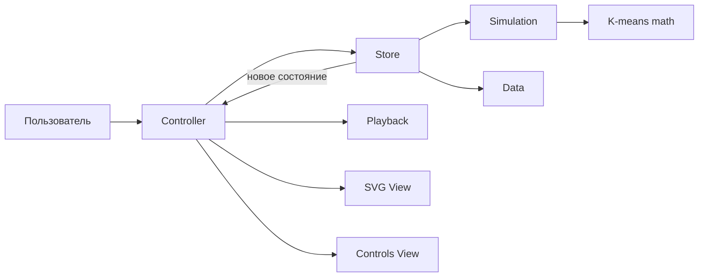
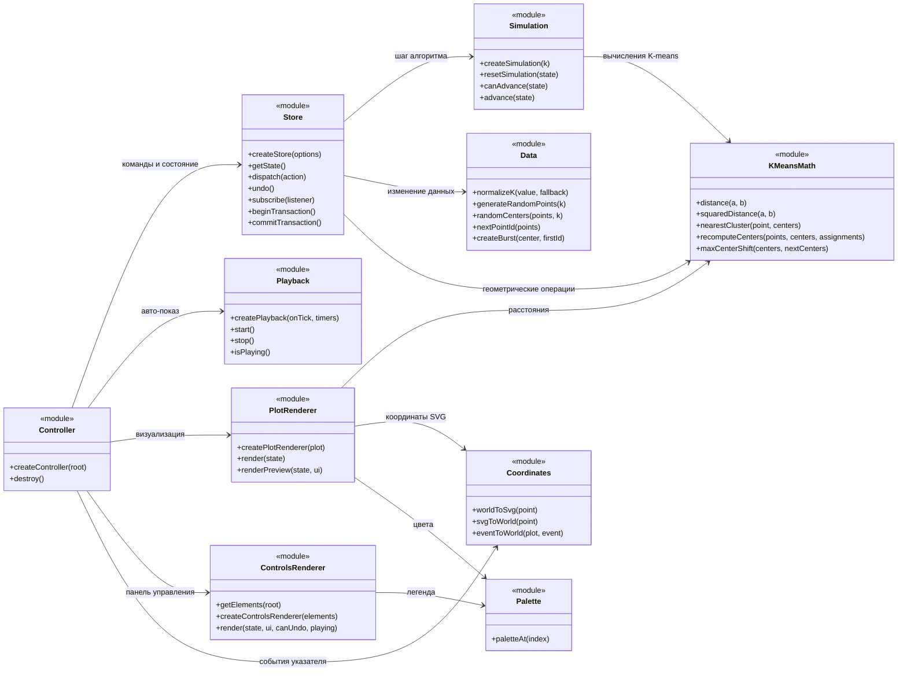
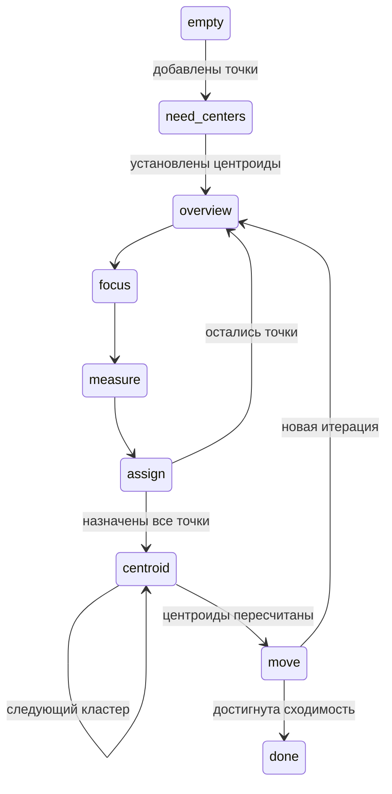

# Интерактивная визуализация алгоритма K-средних

Учебное веб-приложение для пошаговой визуализации алгоритма кластеризации **K-средних (K-means)**.

Приложение показывает не только итоговое разбиение точек на кластеры, но и внутреннюю механику алгоритма: выбор центроидов, вычисление расстояний, назначение точек, пересчёт центров и повторение итераций до сходимости.

## Рабочая версия

Приложение опубликовано через GitHub Pages:

**https://Hello0407.github.io/k-means_visualization/**

Репозиторий проекта:

**https://github.com/Hello0407/k-means_visualization**

---

## Цель проекта

Цель проекта — сделать работу K-means на двумерных данных наглядной и интерактивной.

Вместо показа только конечного результата приложение разбивает алгоритм на отдельные этапы. Пользователь может наблюдать, какая точка рассматривается, как считаются расстояния до центроидов, какой кластер выбирается и как после очередной итерации перемещаются центры кластеров.

## Возможности приложения

В приложении реализованы:

- выбор количества кластеров `k`;
- автоматическая генерация набора точек;
- ручное добавление одной точки;
- добавление группы точек;
- ручная установка центроидов;
- случайная установка центроидов;
- пошаговое выполнение алгоритма;
- автоматический режим демонстрации;
- возврат на предыдущий шаг;
- очистка точек;
- очистка центроидов;
- удаление точек и центроидов с помощью ластика;
- отображение расстояний от активной точки до центроидов;
- визуальное выделение ближайшего центроида;
- пересчёт и анимация перемещения центроидов;
- адаптивный интерфейс для разных размеров экрана.

## Как пользоваться

1. Откройте приложение по рабочей ссылке.
2. Задайте количество кластеров `k`.
3. Нажмите **«Поставить точки автоматически»** или добавьте точки вручную.
4. Установите центроиды вручную либо нажмите **«Случайные центроиды»**.
5. Используйте **«Следующий шаг»** для пошагового просмотра алгоритма.
6. Для автоматического выполнения нажмите **«Авто-показ»**.
7. При необходимости используйте **«Шаг назад»** для возврата к предыдущему состоянию.

---

## Алгоритм K-means

K-means решает задачу кластеризации: множество объектов необходимо разбить на `k` групп так, чтобы каждый объект относился к ближайшему центру своего кластера.

Основной цикл алгоритма:

1. задаётся количество кластеров `k`;
2. выбираются начальные центроиды;
3. каждая точка назначается ближайшему центроиду;
4. для каждого кластера вычисляется новый центроид;
5. шаги 3–4 повторяются до тех пор, пока центроиды практически не перестанут перемещаться.

### Евклидово расстояние

Расстояние между точкой \(x_i\) и центроидом \(c_j\) вычисляется как

$$
d(x_i, c_j)
=
\sqrt{
(x_{i1}-c_{j1})^2 +
(x_{i2}-c_{j2})^2
}.
$$

### Пересчёт центроида

После назначения точек кластеру новый центроид равен среднему значению координат его точек:

$$
c_j =
\frac{1}{|C_j|}
\sum_{x_i \in C_j} x_i.
$$

Для двумерного случая:

$$
c_{jx}
=
\frac{1}{|C_j|}
\sum_{x_i \in C_j} x_{ix},
\qquad
c_{jy}
=
\frac{1}{|C_j|}
\sum_{x_i \in C_j} x_{iy}.
$$

Если после пересчёта максимальный сдвиг центроидов становится меньше заданного порога, алгоритм считается сошедшимся.

---

## Технологии

- **HTML5** — структура страницы;
- **CSS3** — оформление и адаптивная вёрстка;
- **JavaScript** — состояние приложения и логика K-means;
- **SVG** — интерактивная координатная плоскость и визуализация;
- **GitHub Pages** — публикация статического приложения.

Проект не использует frontend-фреймворки, backend и систему сборки. Приложение может работать как обычная статическая страница.

---

## Структура проекта

```text
.
├── index.html                 # HTML-разметка приложения
├── style.css                  # стили интерфейса
├── script.js                  # точка входа приложения
│
├── src/
│   ├── config.js              # общие параметры приложения
│   │
│   ├── domain/
│   │   ├── kmeans.js          # математические операции K-means
│   │   ├── data.js            # создание и нормализация данных
│   │   └── simulation.js      # состояния и переходы алгоритма
│   │
│   ├── app/
│   │   ├── store.js           # состояние, команды и история действий
│   │   ├── playback.js        # управление автоматическим показом
│   │   └── controller.js      # обработка событий и координация модулей
│   │
│   └── view/
│       ├── coordinates.js     # преобразование координат
│       ├── palette.js         # цвета кластеров
│       ├── plot.js            # SVG-визуализация
│       └── controls.js        # элементы панели управления
│
├── tests/                     # автоматические проверки алгоритма и UI
├── tools/
│   └── check_browser.py       # запуск браузерных проверок
├── docs/
│   └── ARCHITECTURE.md        # подробное описание архитектуры
├── .gitignore
└── README.md
```

---

## Архитектура

Архитектура разделена на три основных слоя:

- **Domain** — математическая логика и состояние алгоритма;
- **Application** — управление состоянием, историей действий и событиями;
- **View** — визуализация и элементы интерфейса.

Такое разделение позволяет не смешивать математические вычисления K-means с DOM и SVG-отрисовкой.

### Общая схема


```mermaid
flowchart LR
    User["Пользователь"]
    Controller["Controller"]
    Store["Store"]
    Simulation["Simulation"]
    KMeans["K-means math"]
    Data["Data"]
    Playback["Playback"]
    Plot["SVG View"]
    Controls["Controls View"]

    User --> Controller
    Controller --> Store
    Controller --> Playback
    Controller --> Plot
    Controller --> Controls
    Store --> Simulation
    Store --> Data
    Simulation --> KMeans
    Store -->|новое состояние| Controller
```

### UML-диаграмма

Проект написан в функциональном стиле, поэтому JavaScript-классы намеренно не используются. На UML-диаграмме ниже логические модули представлены как классы со стереотипом `module`; методы соответствуют их публичным интерфейсам.


```mermaid
classDiagram
    direction LR

    class Controller {
        <<module>>
        +createController(root)
        +destroy()
    }

    class Store {
        <<module>>
        +createStore(options)
        +getState()
        +dispatch(action)
        +undo()
        +subscribe(listener)
        +beginTransaction()
        +commitTransaction()
    }

    class Playback {
        <<module>>
        +createPlayback(onTick, timers)
        +start()
        +stop()
        +isPlaying()
    }

    class Simulation {
        <<module>>
        +createSimulation(k)
        +resetSimulation(state)
        +canAdvance(state)
        +advance(state)
    }

    class KMeansMath {
        <<module>>
        +distance(a, b)
        +squaredDistance(a, b)
        +nearestCluster(point, centers)
        +recomputeCenters(points, centers, assignments)
        +maxCenterShift(centers, nextCenters)
    }

    class Data {
        <<module>>
        +normalizeK(value, fallback)
        +generateRandomPoints(k)
        +randomCenters(points, k)
        +nextPointId(points)
        +createBurst(center, firstId)
    }

    class PlotRenderer {
        <<module>>
        +createPlotRenderer(plot)
        +render(state)
        +renderPreview(state, ui)
    }

    class ControlsRenderer {
        <<module>>
        +getElements(root)
        +createControlsRenderer(elements)
        +render(state, ui, canUndo, playing)
    }

    class Coordinates {
        <<module>>
        +worldToSvg(point)
        +svgToWorld(point)
        +eventToWorld(plot, event)
    }

    class Palette {
        <<module>>
        +paletteAt(index)
    }

    Controller --> Store : команды и состояние
    Controller --> Playback : авто-показ
    Controller --> PlotRenderer : визуализация
    Controller --> ControlsRenderer : панель управления
    Controller --> Coordinates : события указателя

    Store --> Simulation : шаг алгоритма
    Store --> Data : изменение данных
    Store --> KMeansMath : геометрические операции

    Simulation --> KMeansMath : вычисления K-means

    PlotRenderer --> KMeansMath : расстояния
    PlotRenderer --> Coordinates : координаты SVG
    PlotRenderer --> Palette : цвета

    ControlsRenderer --> Palette : легенда
```

Подробное описание зависимостей, фаз и архитектурных решений находится в [`docs/ARCHITECTURE.md`](docs/ARCHITECTURE.md).

---

## Состояние приложения

Основное состояние расчёта хранится в `store` и содержит:

- `k` — количество кластеров;
- `points` — набор точек;
- `centers` — текущие центроиды;
- `assignments` — принадлежность точек к кластерам;
- `phase` — текущая фаза демонстрации;
- `iteration` — номер итерации;
- `activePointIndex` — активная точка;
- `activeClusterIndex` — активный кластер;
- `oldCenters` — центроиды до пересчёта;
- `nextCenters` — рассчитанные новые центроиды.

Режим инструмента, положение курсора и таймер автоматического показа отделены от математического состояния и не попадают в историю алгоритма.

История хранит последние действия пользователя и позволяет выполнить **«Шаг назад»**. Один непрерывный жест ластиком сохраняется как одна операция отмены.

---

## Фазы визуализации

Алгоритм представлен конечным набором фаз:


```mermaid
stateDiagram-v2
    empty --> need_centers: добавлены точки
    need_centers --> overview: установлены центроиды
    overview --> focus
    focus --> measure
    measure --> assign
    assign --> overview: остались точки
    assign --> centroid: назначены все точки
    centroid --> centroid: следующий кластер
    centroid --> move: центроиды пересчитаны
    move --> overview: новая итерация
    move --> done: достигнута сходимость
```

Такое представление позволяет отдельно визуализировать каждый логический этап K-means.

---

## Особенности реализации

### Разделение логики и интерфейса

Функции из `src/domain/` не обращаются к DOM, не создают таймеры и не выполняют отрисовку. Они получают данные и возвращают результаты вычислений.

Контроллер отвечает за события пользователя и передаёт команды хранилищу. Представление получает готовое состояние и отображает его.

### История действий

`store.js` поддерживает историю состояний для функции **«Шаг назад»**. Для жеста ластика используется транзакция: множество удалений во время одного движения мыши отменяется одним действием.

### Автоматический показ

`playback.js` управляет единственным таймером автоматического режима и не содержит логики K-means.

### Работа без сборщика

Скрипты подключаются через `defer` в порядке зависимостей. Публичные интерфейсы модулей размещаются в пространстве имён `window.KMeans`.

Такой подход позволяет:

- запускать проект без `npm install`;
- открывать `index.html` напрямую;
- публиковать приложение как статический сайт на GitHub Pages.

---

## Производительность

В реализации применены следующие оптимизации:

- пересчёт центроидов выполняется за `O(n + k)` одним проходом по точкам;
- для внутренних сравнений расстояний используются квадраты расстояний без лишнего вычисления квадратного корня;
- статическая SVG-сетка создаётся один раз;
- предпросмотр положения курсора обновляется отдельно от основной сцены;
- несколько обновлений интерфейса объединяются через `requestAnimationFrame`;
- история хранит снимки состояния без полного JSON-копирования приложения.

Для учебного масштаба задачи это позволяет сохранить одновременно простую архитектуру и отзывчивый интерфейс.

---

## Запуск локально

Установка зависимостей для самого приложения не требуется.

### Вариант 1 — напрямую

Откройте:

```text
index.html
```

в браузере.

### Вариант 2 — локальный HTTP-сервер

В корневой папке проекта выполните:

```bash
python -m http.server 8000
```

После этого откройте:

```text
http://localhost:8000
```

---

## Тестирование

Для проекта предусмотрены автоматические проверки.

После запуска локального HTTP-сервера откройте:

```text
http://localhost:8000/tests/
```

Тесты проверяют:

- математические функции K-means;
- переходы между фазами;
- сходимость;
- изменение количества кластеров;
- работу истории и отмены действий;
- пользовательские кнопки;
- автоматический показ;
- обработку пустых кластеров;
- работу интерфейса в браузере.

Для автоматического запуска браузерных проверок:

```bash
python -m pip install websocket-client
python tools/check_browser.py
```

Пакет `websocket-client` требуется только для этого вспомогательного инструмента и не является зависимостью самого веб-приложения.

---

## Деплой

Проект опубликован через **GitHub Pages**.

Приложение является полностью статическим, поэтому серверная часть не требуется. Для публикации необходимы:

```text
index.html
style.css
script.js
src/
```

GitHub Pages может напрямую отдавать эти файлы из ветки `main`.

---

## Образовательная ценность

Приложение позволяет наблюдать K-means как последовательный процесс, а не только получать готовую кластеризацию.

Пользователь видит:

- какую точку алгоритм рассматривает сейчас;
- расстояния до каждого центроида;
- выбор ближайшего центра;
- назначение точки кластеру;
- вычисление нового положения центроидов;
- движение центроидов между итерациями;
- момент достижения сходимости.

Это делает приложение удобным инструментом для изучения базового алгоритма кластеризации.

---

## Автор

**Бобоев Хилол Шералиевич**
