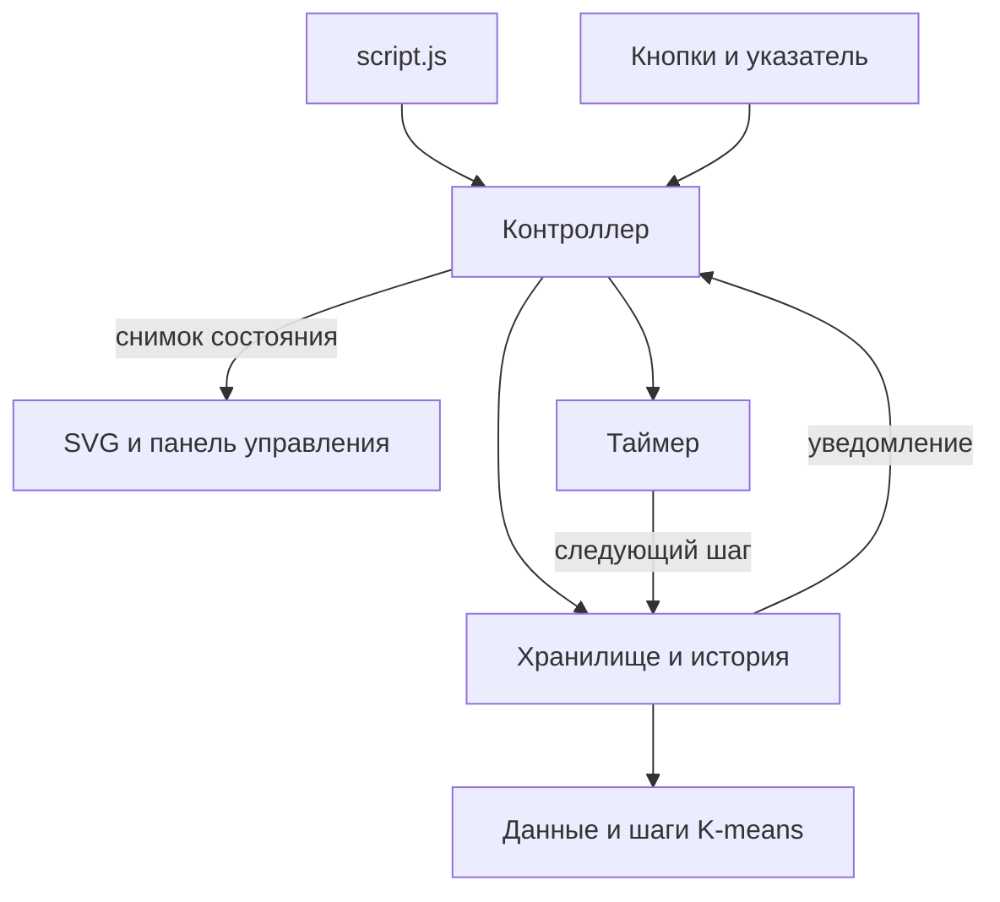
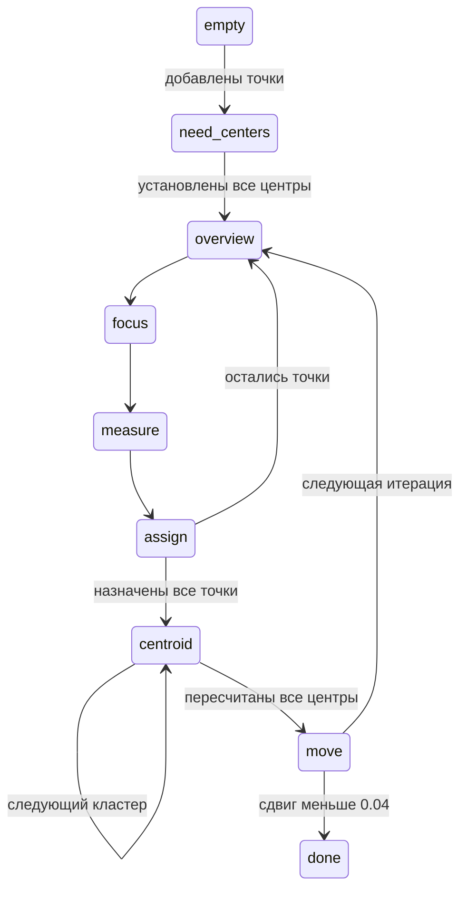

# Архитектура приложения

Приложение остаётся статической страницей на HTML, CSS, JavaScript и SVG. Все 11 кнопок, оформление, этапы демонстрации и запуск двойным щелчком по `index.html` сохранены. Серверная часть и сборка не нужны.

## Границы ответственности

| Каталог / файл | Ответственность |
| --- | --- |
| `src/domain/kmeans.js` | Расстояния, ближайший кластер, средние координаты, сдвиг центров |
| `src/domain/data.js` | Генерация данных, случайные центры, нормализация ввода |
| `src/domain/simulation.js` | Начальное состояние, сброс расчёта и переход к следующему этапу |
| `src/app/store.js` | Изменение данных через команды, история и объединение жеста ластика |
| `src/app/playback.js` | Жизненный цикл единственного таймера автопоказа |
| `src/app/controller.js` | Обработка событий, связь компонентов и планирование обновлений |
| `src/view/coordinates.js` | Преобразование координат SVG и указателя |
| `src/view/plot.js` | Отрисовка сетки, расчёта и предпросмотра указателя |
| `src/view/controls.js` | Ссылки на элементы страницы, кнопки и легенда |
| `src/view/palette.js` | Цвета кластеров |
| `src/config.js` | Общие числовые параметры |
| `script.js` | Создание экземпляра приложения и освобождение ресурсов при закрытии |

Функции алгоритма не обращаются к DOM, не запускают таймеры и не вызывают отрисовку. Представление читает состояние, но не меняет его. Контроллер соединяет эти части. Обратных зависимостей от алгоритма к интерфейсу нет.

## Загрузка модулей

Каждый файл заключён в собственную функцию и публикует небольшой API в единственном пространстве имён `window.KMeans`. Зависимости перечислены в начале файла. Поля, временные переменные и функции, не входящие в API, остаются внутри замыкания.

Скрипты подключены с `defer` в порядке зависимостей в `index.html`: конфигурация → алгоритм → хранилище и таймер → представление → контроллер → точка входа. Это осознанный выбор для поддержки `file://`: обычные ES-модули потребовали бы локального HTTP-сервера. Для текущего размера проекта отдельный сборщик не нужен.

## Состояние и история

В хранилище находятся только данные расчёта:

- `k`, `points`, `centers`, `assignments`;
- `phase`, `iteration`, `activePointIndex`, `activeClusterIndex`;
- `oldCenters`, `nextCenters`.

`dispatch({ type, ...payload })` применяет команду и уведомляет подписчиков. Если действие ничего не изменило, возвращается прежний снимок и история не пополняется. Например, нельзя добавить третий центроид при `k = 2`, а «Следующий шаг» на пустой плоскости ничего не меняет.

Снимки считаются неизменяемыми: нельзя записывать в результат `getState()` или менять его массивы. Каждая операция возвращает новый объект и копирует только изменяемые массивы. Остальные данные используются совместно. Поэтому для истории не требуется полное копирование и сравнение через `JSON.stringify` на каждом шаге. Хранятся последние 80 действий.

`beginTransaction()` и `commitTransaction()` объединяют все удаления одного жеста ластика. «Шаг назад» возвращает состояние до начала жеста. Пустой жест не добавляет историю.

Режим указателя, положение курсора и захваченный указатель принадлежат контроллеру. Таймер принадлежит модулю автопоказа. Они не входят в снимки алгоритма. Откат и изменение данных останавливают автопоказ. Ручной следующий шаг во время автопоказа сохраняет работающий таймер.

## Этапы алгоритма

В коде подготовительная фаза называется `need-centers`. Изменение точек, центров или `k` сбрасывает расчёт через одну функцию `resetSimulation()`. Если кластер пуст, его центр остаётся на прежнем месте. При равных расстояниях выбирается первый центр. Это сохраняет правила исходного приложения.

## Что оптимизировано

- Средние координаты пересчитываются за `O(n + k)`: один проход по точкам и один по центрам. Раньше для каждого центра заново фильтровались все точки, то есть `O(n × k)`.
- Для сравнения расстояний используются их квадраты. Корень вычисляется только там, где нужно показать расстояние или проверить сдвиг.
- Для таблицы расстояний на графике ближайший центр выбирается один раз, а не заново для каждого центра.
- Сетка и SVG-маркер создаются один раз. Легенда обновляется при изменении `k`.
- Движение указателя обновляет отдельный слой предпросмотра. Сцена с точками при этом не перестраивается.
- `requestAnimationFrame` объединяет поступившие обновления в один кадр. Содержимое сцены подготавливается в `DocumentFragment`.
- Удалены неиспользуемые функции и CSS удалённых панелей. Все элементы действующей страницы сохранены.

Сцена расчёта пока перестраивается целиком при изменении данных или фазы. Для учебной визуализации это сохраняет простой код; частичное обновление каждой точки потребует дополнительного учёта объектов. Абсолютное ускорение зависит от количества точек и браузера, отдельный benchmark не проводился.

## Обработка указателя и завершение работы

Координаты клика преобразуются через обратную матрицу SVG (`getScreenCTM()`), поэтому учитываются масштабирование и свободные поля `viewBox`. Ластик использует Pointer Events и захват указателя: завершение жеста за пределами плоскости не оставляет приложение в режиме удаления.

`destroy()` выключает таймер, отменяет запланированный кадр, отписывается от хранилища и снимает обработчики через `AbortController`. Его можно безопасно вызвать повторно.

## Как добавлять возможности

1. Расчёт или математическое правило добавляется в `domain/` и проверяется на фиксированных данных.
2. Изменение данных оформляется командой в `store.js`. Для отмены достаточно вернуть новый снимок.
3. Кнопка связывается с командой в контроллере. Из обработчика не следует напрямую менять массивы или SVG.
4. Новое отображение добавляется в `view/`. Оно получает готовое состояние.

Не нужно вводить фреймворк или сервер ради новой кнопки. Если появятся удалённое сохранение, совместная работа или большие наборы данных, архитектуру можно расширить под эти конкретные требования.

## Проверки

Откройте `tests/index.html` через локальный HTTP-сервер. Тесты используют настоящий интерфейс из `index.html` и проверяют математику, фазы, историю, изменение `k`, пустые кластеры, кнопки, таймер, освобождение обработчиков и сохранение DOM при движении указателя.

`python tools/check_browser.py` запускает те же тесты в установленном Edge/Chrome без окна, затем отдельно проверяет `file://`, настоящий жест мышью и его отмену при ширинах 1440 и 390 пикселей. Для автоматического запуска нужны Python и пакет `websocket-client`; само приложение и ручной запуск тестовой страницы от него не зависят. Результат сохраняется в `.test-artifacts/results.json`. Тестовый профиль браузера также остаётся в `.test-artifacts/` для диагностики и не включается в Git.
